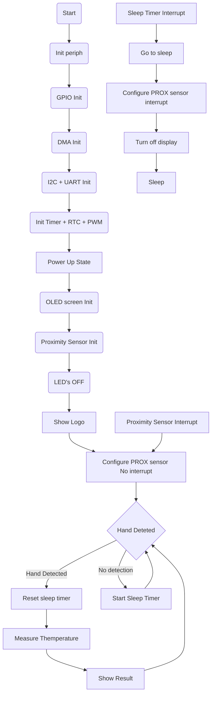

# Bat thermometer

State machine:

```mermaid
graph TD;
    Start(Start)-->Init("Init periph");
    Init-->MX_GPIO_Init("GPIO Init");
    MX_GPIO_Init-->MX_DMA_Init("DMA Init");
    MX_DMA_Init-->Communication("I2C + UART Init");
    Communication-->Timers("Init Timer + RTC + PWM");
    Timers-->POWERUP["Power Up State"];
    POWERUP-->ssd1306_Init("OLED screen Init");
    ssd1306_Init-->APDS9960_init("Proximity Sensor Init");
    APDS9960_init-->LED_PWM_OFF("LED's OFF");
    LED_PWM_OFF-->ShowLogo["Show Logo"];
    ShowLogo-->PROX_CONFIG_FOR_POLLING["Configure PROX sensor No interrupt"];
    PROX_CONFIG_FOR_POLLING-->WAIT_FOR_HAND{"Hand Deteted"};
    WAIT_FOR_HAND--Hand Detected-->TIMER_RESET["Reset sleep timer"];
    TIMER_RESET-->TEMP_MEASURE["Measure Themperature"];
    WAIT_FOR_HAND--No detection-->TIMEOUT["Start Sleep Timer"];
    TIMEOUT-->WAIT_FOR_HAND;
    TEMP_MEASURE-->SHOW_RESULT["Show Result"];
    SHOW_RESULT-->WAIT_FOR_HAND;
    TIMEOUT_INTERRUPT["Sleep Timer Interrupt"]-->GOTO_SLEEP["Go to sleep"];
    GOTO_SLEEP-->PROX_CONFIG_FOR_INTERRUPT["Configure PROX sensor interrupt"];
    PROX_CONFIG_FOR_INTERRUPT-->TURN_OFF_DISP["Turn off display"];
    TURN_OFF_DISP-->SLEEP["Sleep"];
    PROX_INTERRUPT["Proximity Sensor Interrupt"]-->PROX_CONFIG_FOR_POLLING;
```
